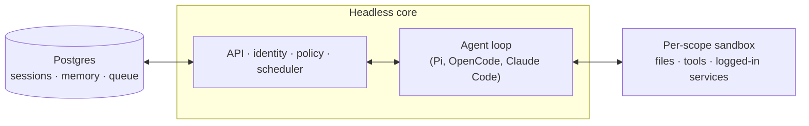

# qm

A multiplayer agent harness for work. In Slack and on the web.


## Setup

Tell your coding agent of choice `Let's deploy https://github.com/yc-software/qm`. From here, it should follow the deployment guide in this repo.

You can also try out a 3rd-party hosted version of QM [here](https://www.agent37.com/qm).

If you're an infra provider interested in offering a hosted version of QM, feel free to reach out.

## What is QM?

Most agents are designed like personal assistants. You can make one work for a whole
company, but it quickly gets complex. QM is designed for startups. Employees each get
their own isolated workspace and work independently without affecting each other, and
they can also collaborate with the agent in channels, group messages, and projects.

Each person and each room has its own scoped memory, files, keychain view, permissions,
crons, web apps, and durable sandbox.

It's built with open source in mind. Pick your own harness and model and switch between
them — Pi, OpenCode, Codex, and Claude Code all drive the same core, so a deployment
isn't tied to any single vendor.

## Features

- **Personal and shared scopes.** People customize the agent to be _theirs_, and still
  work with it collaboratively in Slack channels and projects.
- **Slack and web.** The same identity and configuration carries between Slack and the
  web app.
- **Admin control.** Set org-level configuration, security and sharing postures, and which
  harnesses and models are available.
- **Web apps.** Spin up custom internal apps and publish them to the right people.
- **Shared skills.** Skills are scope-owned and shareable by grant, with admin-gated
  promotion to the whole org and skill packs imported from git repositories.
- **Background work.** Crons, watches, and inbound webhooks run work while nobody's
  watching.

## What you can do with it

- Search internal notes, email, documents, databases, and the web together
- Build internal apps, publish them to the right people, and keep their data current
- Learn your writing voice from past sends, then triage your inbox on a schedule —
  labels and reply drafts included
- Work in an existing repository: run tests, open PRs, monitor CI, check system logs
- Track a project in a shared channel and post updates and follow-ups

## Architecture



For durability, set `DATABASE_URL` and `SESSION_STORE=postgres` — without it, sessions
live in process memory and vanish on restart. To exercise a branch against a real model and real Postgres, run
`npm run dev-instance:web` for web/admin or `npm run dev-instance:slack` for Slack.
Use `npm run dev-instance:both` when testing both surfaces together. Bare
`npm run dev-instance` defaults to web for new instances and preserves the surface
on reload. Switch an existing instance with an explicit surface command.

## Architecture

Every turn runs through a central core, which can use a variety of models and harnesses
to generate the response. A Postgres persistence layer holds user data, session history,
and other durable state. The agent has a small, fixed tool surface; one of those tools is
`execute`, which runs commands in the scope's own isolated sandbox — its durable computer,
where installed tools stay installed. The web UI and admin panel share one service; the portal and optional built-in
auth broker share another. These modules communicate with core over its HTTP API.
See [combined services](docs/combined-services.md) for configuration and migration;
Slack is an optional in-process plugin that core starts
and supervises through a direct service client.

The core runs TypeScript directly on Node and uses Fastify for HTTP. The Slack plugin
uses Bolt; the web UI builds with Vite and renders with Lit.

The core itself is generic. Everything specific to one company — org config, custom tools
and skills, sandbox image, infrastructure — lives in a **deployment directory** that the
[`qm` CLI](./cli/README.md) validates and deploys. Every substrate (harness, session
store, sandbox, memory) sits behind an interface. Memory can also be routed by scope to
[external providers](./docs/memory-providers.md) while retaining the built-in notebook.

## Security and secrets

QM's approach follows local coding agents like OpenCode, Codex, and Claude Code: the
agent acts as the person it's working for, with their credentials and permissions, and
everything it does is audited. An org picks one security posture, which narrower scopes
can only tighten:

- **Strict** — every harness tool call pauses for human approval, except the two
  no-effect turn enders.
- **Auto** (default) — blocks private-network access and uses a content screener when
  the deployment configures one. Model screening is off by default; deployments can
  use an external proxy or explicitly opt into the built-in model classifier.
- **Dangerous** — no content screening, no pauses between tool calls.

The predeclared command policy — approval rules and hard denials for things like
recursive deletes or destructive SQL — applies in every posture, Dangerous included.

Sharing posture is independent:

- **Isolated** (default) — resources stay in their scope unless explicitly shared.
- **Open** — on a live authenticated internal human turn, the speaker's opted-in personal
  files, artifacts, skills, and memory may be read in an opted-in shared room. In the
  speaker's DM, files and skills from up to 25 recent shared contexts where they are still
  a member are available. Included memories are loaded into the prompt in full with source-scope
  labels and are also searchable; relevance ranking is not applied.
  The candidate window is limited to 100 recent sessions and file discovery to 200 files.
  Binary files still require explicit sharing before entering another conversation's computer.
  Cross-context memory search is available only through the active turn's memory tool;
  reusable sandbox API tokens retain their original memory scope.

The organization value is a ceiling, and personal and room scopes can opt out; Isolated
wins. “Follow organization” removes a personal or room override. Disabled memory recall
and writable-only recall still apply. Open does not mount a personal workspace into a room, carry credentials or message
history, widen writes, run in automation or ambient turns, cross organizations, add a
teammate's entitlement, or weaken screening, command approvals, or egress. It can still
reveal private information in a shared reply, so cross-context reads are provenance-labelled
and audited.

[`SECURITY.md`](./SECURITY.md) has the threat model, the operator assumptions, and the
known limitations.

## Deploy it for your org

Create an organization-owned deployment repository that depends on `@yc-software/qm`:

```bash
npm exec --yes --package=@yc-software/qm@latest -- \
  qm init . --org <slug> --target <fly-or-aws>
npm install
```

Initialization materializes a deployment skill for an agent and walks through
infrastructure, web sign-in, connector credentials, optional Slack access, deployment,
and live verification — no source checkout required. Each deployment runs in the
operator's own cloud account; initialization does not generate or enable deployment CI,
and this repository has no production deployment workflow. See
[`deployment.md`](./deployment.md) for the details.

## Contributing

We take contributions as _human-written_ text, not code — see
[`CONTRIBUTING.md`](./CONTRIBUTING.md). Describe the change you'd like informally in a
`.txt` or `.md` file in [`adrs/`](./adrs/), and if we're aligned we'll handle the
implementation. Report vulnerabilities privately — see [`SECURITY.md`](./SECURITY.md),
not a public issue.

## Customize your instance

Choose how you want to customize QM:

- **Config, tools, skills, and services:** use the deployment repository above. It
  pins `@yc-software/qm` and uses that release's runtime images; no source copy is needed.
- **Changes to QM itself:** keep your own source fork, public or private. You may
  modify any part of core, including the runtime, plugins, CLI, docs, and CI.
  Contributing those changes upstream is optional.

### Create a source fork

For a private source fork, create a standalone private repository, outside GitHub's
fork network. Seed only `main` and explicitly set it as the default branch:

```bash
gh repo create <org>/qm-private --private
git clone --single-branch --branch main --no-tags git@github.com:yc-software/qm qm-private
git -C qm-private remote rename origin upstream
git -C qm-private remote add origin git@github.com:<org>/qm-private
git -C qm-private push -u origin main
gh repo edit <org>/qm-private --default-branch main
```

Do not seed with `git push --mirror`: it copies unrelated upstream branches and tags,
leaves default-branch selection implicit, and can delete destination-only refs on later
pushes. The `upstream` remote supplies source updates without copying those refs to your
repository. For a public source fork, GitHub's Fork button is also an option. A GitHub
fork of a public repository cannot be private; keep private work outside that network.

Review inherited workflows before enabling Actions or adding credentials. Choose the CI
checks you want, and disable or adapt upstream release and publishing workflows for your
own package and image registries. Copying the source does not configure production
deployment CI.

### Customize and run your source

Keep deployment configuration, tools, skills, plugin images, and infrastructure in
`deploy/layers/<org>/` in a private source fork, or in a separate private deployment
repository when your source is public. Never commit secrets. See
[`deploy/layers/README.md`](./deploy/layers/README.md) for initialization and layout.
Keep deployment data separate from core code, but change core wherever your desired
behavior requires it.

From the source checkout, install dependencies with `npm ci` and use the in-tree CLI.
After completing the provider setup in [`deployment.md`](./deployment.md), build and
deploy your modified services explicitly:

```bash
node cli/bin/qm.ts check --config <deployment-dir>/qm.config.jsonc
node cli/bin/qm.ts plan --config <deployment-dir>/qm.config.jsonc --build-from .
node cli/bin/qm.ts up --config <deployment-dir>/qm.config.jsonc --build-from .
node cli/bin/qm.ts check --config <deployment-dir>/qm.config.jsonc --live
```

Use this checkout's CLI when changing the CLI itself. Without `--build-from`, the
normal deployment path selects published images, so editing source alone does not
change the deployed runtime. If you publish custom images instead, configure their
immutable references through `imageOverrides`. Follow the provider guide for sandbox
image builds; service builds do not replace that step.

### Keep it current

For a source fork, `update-qm` merges upstream changes while preserving intentional
local behavior. Land sync PRs with their merge ancestry intact, never squash or rebase
them. Conflicts are expected maintenance work, not a requirement to discard
customizations. Use `upstream-pr` only when you want to contribute a generic change;
it prepares a clean upstream branch without private deployment data or history.

For a package deployment, upgrade the exact `@yc-software/qm` dependency and lockfile,
review contract changes and generated assets, then validate and deploy. There is no
upstream source history to merge.

## Going deeper

- [`docs/swarms.md`](./docs/swarms.md) — durable agent pools, scoped messages, and blank Modal workers
- [`docs/model-gateway.md`](./docs/model-gateway.md) — discover and route models through a gateway
- [`docs/getting-started.md`](./docs/getting-started.md) — first run, end to end
- [`cli/README.md`](./cli/README.md) — the `qm` CLI and the deployment directory contract
- [`docs/deploy-directory.md`](./docs/deploy-directory.md) — the deployment directory in full
- [`docs/principal-links.md`](./docs/principal-links.md) — one person, several sign-ins: linking principals
- [`docs/porter.md`](./docs/porter.md) — running qm on Porter
- [`docs/superserve.md`](./docs/superserve.md) — using Superserve for agent sandboxes
- [`.env.example`](./.env.example) — every knob, documented in place
- [`plugins/`](./plugins) — the surfaces (Slack, web UI, admin, portal)

## License

Except where otherwise noted, QM is available under the [MIT License](./LICENSE).

### Managed Slack installation

A hosting provider can set `QM_SLACK_SERVICE_URL` (HTTPS),
`QM_SLACK_SERVICE_TOKEN` (unique per deployment) on core. Optionally set
`QM_SLACK_APP_ID` to pin a pre-existing app; otherwise the authenticated service
assigns its app ID during installation. Events must match the stored app identity.
Set `QM_SLACK_SERVICE_URL` on the admin/web service as well so its browser policy allows the installation form.
The admin Slack card then offers **Add to Slack** through that service. Core calls
`POST /install/start` with the deployment bearer credential and expects `{ "url":
"https://<service>/..." }`. The browser submits a POST form to that URL; the service must validate its Origin against the company URL. The service owns browser-bound OAuth state, Slack
signature verification, workspace ownership, and app credentials.

The portal forwards only `POST /v1/slack/managed/installation`, `DELETE` on that
same path, and `POST /v1/slack/managed/events` without a browser session. Core
requires the deployment bearer credential on each request. Installation takes
`botToken`, `appId`, `teamId`, `installId`, `installedAt` (epoch milliseconds), and
optional `teamName`. Repeat the same installation request until it returns 200
with `ready: true`; 202 means the encrypted token is saved but the runtime has
not started. Older installation generations and conflicting workspaces fail
closed. Deletion takes `installId` and only disables that generation.

Delivery takes `{ installId, body, retryNum?, retryReason? }`, where `body` is the
verified Slack event or decoded interaction payload. Core checks its workspace
and app before passing it to the existing Slack runtime and acknowledgment
machinery. There is no shared queue: unavailable core instances return failures,
and the hosting service must relay those failures to Slack. The service must
process lifecycle events and ignore revocations older than the installation.

Managed deployments also support an administrator-provided Slack app through the same
Slack settings card. Saving its validated bot and Socket Mode tokens replaces the
managed runtime and rejects subsequent managed installation callbacks. To return to
the managed app, disconnect the administrator-provided app in QM, then explicitly
choose **Add to Slack**. Disconnecting alone does not permit old managed callbacks to
restore an installation.

Use the same Slack workspace when replacing the managed app, so existing conversations
and memberships remain associated with that workspace. Invite the new bot to the
channels it should serve; Slack does not transfer the old bot's memberships. Once
replacement is verified, remove the old managed app from Slack to avoid two visible
QM identities. QM rejects deliveries for the old installation as soon as the new
credentials are saved. The replacement uses Socket Mode even if the deployment's
environment previously selected HTTP events.
