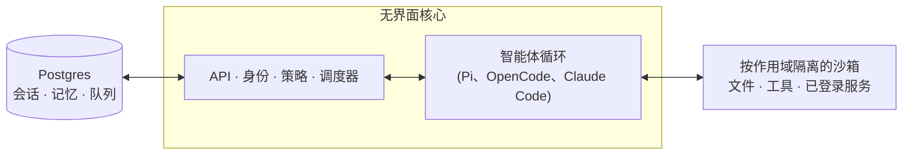

# qm

[English](./README.md) · 中文

一个面向团队协作的多人智能体运行框架，支持 Slack 和 Web。


## 什么是 QM？

大多数智能体都被设计成个人助手。你也可以让一个智能体为整个公司工作，但很快就会变得复杂。QM 面向初创公司设计：每位员工都有自己的隔离工作区，可以独立工作而互不影响；他们也可以在频道、群聊和项目中与智能体协作。

每个人和每个房间都有自己独立作用域的记忆、文件、密钥链视图、权限、定时任务、Web 应用和持久化沙箱。

QM 以开源为核心。你可以选择自己的 harness 和模型，并在它们之间切换——Pi、OpenCode、Codex 和 Claude Code 都驱动同一个核心，因此部署不依赖于某个单一厂商。

## 功能

- **个人作用域和共享作用域。** 用户可以把智能体定制成属于自己的助手，同时继续在 Slack 频道和项目中协作使用。
- **Slack 和 Web。** 同一套身份和配置可以在 Slack 与 Web 应用之间保持一致。
- **管理员控制。** 设置组织级配置、安全策略，以及可用的 harness 和模型。
- **Web 应用。** 创建自定义内部应用，并将它们发布给合适的人员。
- **共享 Skills。** Skills 由作用域拥有，可以通过授权共享；管理员可以将其提升为全组织可用，也可以从 git 仓库导入 skill 包。
- **后台工作。** 定时任务和监视任务会在无人关注时继续运行。

## 你可以用它做什么

- 同时搜索内部笔记、邮件、文档、数据库和 Web
- 从公司的知识库中检索信息
- 构建内部应用，将它们发布给合适的人员，并持续更新其中的数据
- 从过去发送过的内容中学习你的写作风格，然后按计划整理收件箱——包括标签和回复草稿
- 在现有仓库中工作：运行测试、创建 PR、监控 CI、检查系统日志
- 在共享频道中跟踪项目，并发布更新和后续事项

## 架构



每一轮交互都会经过中央核心，核心可以使用多种模型和 harness 来生成回复。Postgres 持久化层保存用户数据、会话历史和其他持久状态。智能体拥有一组小而固定的工具，其中一个工具是 `execute`，它会在该作用域独立隔离的沙箱中运行命令——这是一个持久化的计算机环境，已安装的工具会一直保留。Web UI、管理面板和公共门户都是基于核心 HTTP API 的可选插件；Slack 是一个可选的进程内插件，由核心通过直接服务客户端启动并监管。

核心直接在 Node 上运行 TypeScript，并使用 Fastify 提供 HTTP 服务。Slack 插件使用 Bolt；Web UI 使用 Vite 构建，并通过 Lit 渲染。

核心本身是通用的。所有特定于某个公司的内容——组织配置、自定义工具和 Skills、沙箱镜像、基础设施——都放在**部署目录**中，由 [`qm` CLI](./cli/README.md) 负责校验和部署。每个底层组件（harness、会话存储、沙箱、记忆）都位于一个接口之后，因此生产实现可以通过一个 wiring 文件进行替换。

## 安全和密钥

QM 的方法遵循 OpenCode、Codex 和 Claude Code 等本地编码智能体的模式：智能体以协作者本人的身份工作，使用其凭据和权限，并对所有操作进行审计。组织可以选择一种安全策略，更窄的作用域只能进一步收紧该策略：

- **Strict（严格）** —— 除了两个无副作用的回合结束工具外，每次 harness 工具调用都会暂停并等待人工批准。
- **Auto（自动，默认）** —— 分类器会在外部数据和工具结果到达模型之前，先对带有来源标记的内容进行筛查；部署可以将筛查请求指向自有的筛查代理。
- **Dangerous（危险）** —— 不进行内容筛查，工具调用之间也不会暂停。

预先声明的命令策略——包括审批规则，以及对递归删除或破坏性 SQL 等操作的硬性拒绝——适用于所有策略，包括 Dangerous。

[`SECURITY.md`](./SECURITY.md) 包含威胁模型、运营方假设和已知限制。

## 为你的组织部署

创建一个组织自有的部署仓库，并依赖 `@yc-software/qm`：

```bash
npm exec --yes --package=@yc-software/qm@latest -- \
  qm init . --org <slug> --target <fly-or-aws>
npm install
```

初始化过程会为智能体生成一个部署 Skill，并引导你完成基础设施、Web 登录、连接器凭据、可选的 Slack 访问、部署和在线验证——无需检出源代码。每个部署都运行在运营方自己的云账号中；初始化不会生成或启用部署 CI，本仓库也没有生产部署工作流。详情请参阅 [`deployment.md`](./deployment.md)。

## 参与贡献

我们希望贡献以**人工撰写**的文本形式提交，而不是代码——请参阅[`贡献指南`](./CONTRIBUTING.zh-CN.md)。请在 [`adrs/`](./adrs/) 中创建 `.txt` 或 `.md` 文件，以较为随意的方式描述你想做的改动；如果方向一致，我们会负责投入资源完成底层实现。请私下报告安全漏洞——参阅 [`SECURITY.md`](./SECURITY.md)，不要提交公开 issue。

## 定制你的实例

上面的部署仓库包含配置和沙箱层，并且不需要检出源代码。有些组织希望做出相反的取舍：将整个代码库放在同一个地方，让工程师和编码智能体同时读取核心与定制内容，同时让定制内容保持私有。此时可以保留一个**私有下游副本**：一个独立的私有仓库，其历史记录从 qm 的克隆开始，并保持核心与上游一致。

先完成一次初始化，然后将它克隆下来使用：

```bash
gh repo create <org>/qm-private --private

git clone --bare git@github.com:yc-software/qm qm-seed.git
git -C qm-seed.git push --mirror git@github.com:<org>/qm-private
rm -rf qm-seed.git

git clone git@github.com:<org>/qm-private
git -C qm-private remote add upstream git@github.com:yc-software/qm
```

请像上面这样通过普通 clone 创建私有下游副本，不要使用 GitHub 的 fork 功能。这里的“fork”指的是有意分叉、并从上游合并的下游副本这一概念，而不是 GitHub 的 Fork 按钮。GitHub fork 会继承源仓库的可见性，因此公开仓库的 fork 无法设为私有。GitHub fork 还会与源仓库共享同一个对象网络，因此推送到 fork 的提交仍可从公开侧按 SHA 获取。许多组织也不允许对私有仓库创建 fork。普通 clone 不存在这些问题，但需要付出一个代价：这个 clone 是一个普通仓库，因此上游的 CI 工作流会在你自己的账号中实时运行。请准备好这些工作流所需的密钥，或者禁用不需要运行的工作流。

所有特定于你组织的内容都放在 `deploy/layers/<org>/` 下——包括配置、沙箱工具和 Skills、插件镜像、基础设施——目录结构与 `qm init` 生成的结构相同。请参阅 [`deploy/layers/README.md`](./deploy/layers/README.md)。核心与上游保持字节级一致，这正是让合并保持精简的关键。

有两个 Skills 负责维护这条边界的双向同步。`update-qm` 将上游 qm 合并到私有下游副本并创建同步 PR；`upstream-pr` 将与组织无关的修复发回 qm：它从 `upstream/main` 创建分支，并在推送前检查待发出的 diff、提交信息和截图中是否包含组织标识符。`deploy/layers/` 下的任何内容都不会被发送到上游。

## 深入了解

- [`docs/getting-started.md`](./docs/getting-started.md) —— 从头到尾完成首次运行
- [`cli/README.md`](./cli/README.md) —— `qm` CLI 和部署目录约定
- [`docs/deploy-directory.md`](./docs/deploy-directory.md) —— 完整的部署目录说明
- [`.env.example`](./.env.example) —— 所有配置项，均在原处说明
- [`plugins/`](./plugins) —— 各个扩展面（Slack、Web UI、管理面板、公共门户）

## 许可证

除非另有说明，QM 采用 [MIT License](./LICENSE) 许可证。
