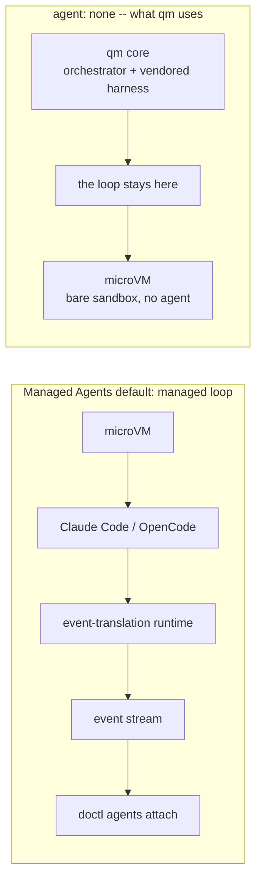
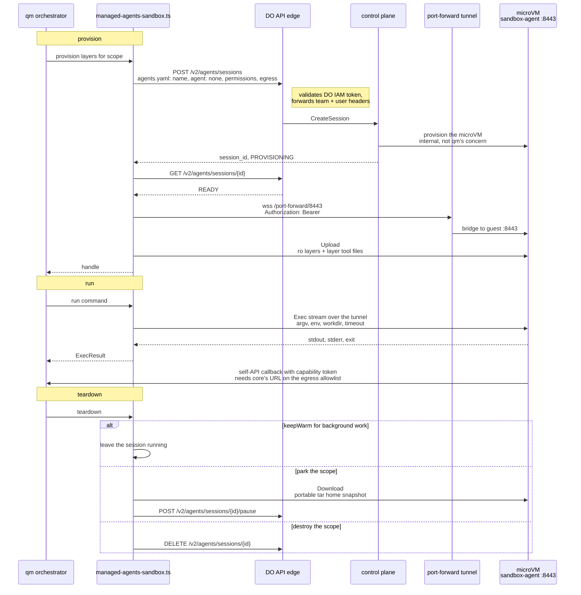

# Managed Agents as an agent-computer backend

This was written by the Managed Agents team at DigitalOcean. Managed Agents (Managed Agent Runtime Stack) hosts coding agents in DO-managed Firecracker microVMs. We looked at what it would take for qm to run on it and the answer is the same one Agent37 arrived at: the part of qm that wants hosting is the agent computer, so this is another sandbox backend, next to E2B, Modal, Sprites, smolmachines, Porter, AWS, Superserve and Agent37.

The reason this is worth doing at all is that Managed Agents is a managed-loop product by default — it boots Claude Code or OpenCode _inside_ the microVM, next to a runtime process that translates agent events back to our control plane and an event stream that `doctl agents attach` tails. That is not what qm wants, because qm already has a loop. But our platform now admits a session with no agent in it at all: a manifest that says `agent: none` lands on Managed Agents's own bare base template, with no managed agent, no event-translation runtime, and no model credential. The caller drives the microVM itself over exec, workspace transfer and port-forward. That mode exists for customers who want Managed Agents purely for code execution — evaluations, CI-style fan-out, arbitrary compute — and qm lands in the same seat. Nothing about qm's orchestrator, harness router or tool surface has to change.

The lifecycle lines up closely enough with the E2B backend that this is modeled on that pair of files rather than on a new shape. One Managed Agents session per qm scope, created on first use, named with the scope name so an operator can find it with `doctl agents list`, paused at teardown, deleted when qm destroys the scope. Our pause keeps the microVM's disk and memory, which is what `provider_managed` persistence already means in your profile.

Everything qm needs is on one host with one credential. Session lifecycle is our control plane, which external callers reach as REST through the DO API edge, which validates a DO IAM token and forwards the authenticated team and user as headers — the same path doctl takes. So that half is plain HTTP+JSON with a token, and the team identity comes from the token rather than from configuration.

Exec and file transfer take a different route to the same host. Every microVM runs `sandbox-agent`, a gRPC server on guest port 8443 that our own control plane dials for exec, transfer and readiness. qm reaches it the way `doctl agents port-forward` does: a bearer-authenticated WebSocket to `/v2/agents/sessions/{id}/port-forward/8443`, which the control plane bridges to the guest port and qm exposes as a local TCP listener for a gRPC client. 8443 is explicitly allowed by our tunnel port policy, the guest listener is plaintext h2c with no client certificate, and we register the port-forward route without a request deadline on purpose. So a long command is bounded by qm's own `SANDBOX_TIMEOUT_SEC` and nothing else.

Worth saying why qm does not use `POST /v2/agents/sessions/{id}/sandbox/exec`, since we built it and it looks like the obvious fit. It terminates in the control plane and buffers the result, so it clamps to four minutes and one mebibyte per stream and carries no per-command environment. Those bounds are right for `doctl agents exec` and wrong for an agent turn.

Here is a turn end to end. Lifecycle goes through the edge as REST; exec and files go through the tunnel to the guest.

What the PR adds

- `SANDBOX_BACKEND=do-managed-agents`, with `DO_AGENTS_API_TOKEN` required — a DO IAM token, which is also where the team identity comes from, and the only credential the backend needs. Optional knobs: `DO_AGENTS_API_BASE_URL`, `DO_AGENTS_TEMPLATE`, `DO_AGENTS_NAME_PREFIX`, `DO_AGENTS_SIZE_SLUG`, `DO_AGENTS_IDLE_TIMEOUT_SEC`, `DO_AGENTS_EGRESS_PROXY_URL`, `DO_AGENTS_SNAPSHOT_INTERVAL_SEC`, `DO_AGENTS_SNAPSHOT_S3_BUCKET`, and the shared `SANDBOX_TIMEOUT_SEC`.
- `src/sandbox/managed-agents-tunnel.ts`, the port-forward client: one WebSocket per TCP connection, bytes piped both ways with one chunk in flight per direction so a slow consumer cannot make core buffer the stream. The local listener is unreferenced, so an abandoned tunnel can never hold core's event loop open.
- `src/sandbox/managed-agents-client.ts`, holding both transports behind one interface the way `e2b-client.ts` wraps the E2B SDK: REST for `/v2/agents/sessions{,/{id},/{id}/pause,/{id}/resume}`, and `SandboxAgentService` stubs for `Exec`, `Upload` and `Download` over the tunnel. Our 404s, terminal statuses and gRPC `UNAVAILABLE` translate to the same two error classes the E2B client uses — one for a sandbox that was already gone before a command started, which the backend reconnects and retries, and one for a sandbox lost mid-command, which is reported rather than retried because the command may have partially run. The session body is an agents.yaml manifest in its flat form, which is the shape we are standardising on.
- `src/sandbox/managed-agents-sandbox-agent.proto`, a vendored copy of our guest proto with the internal annotations stripped, loaded at runtime through `@grpc/proto-loader`. No build step and no generated code in the tree.
- `src/sandbox/managed-agents-sandbox.ts`. Provision creates or resumes the session and waits for it to become usable. Run is `Exec` over the tunnel. Files are `Upload` and `Download` rather than base64 through exec, since we have real transfer RPCs. Process sessions, read-only layers, layer tool install, home snapshots and blob staging come from the shared exec helpers unchanged.
- Scope recovery without local state. Session names are team-unique among non-terminal sessions and `ListSessions` takes a `?name=` filter, so the backend can re-adopt a running sandbox after losing its durable record, the way the E2B backend re-adopts by sandbox metadata. `sandboxScopeName` already produces names that fit our 64-character, not-UUID-shaped rule.
- Profile: `writablePersistence: "provider_managed"`, `processSessions: true`, `parksOnTeardown: true`, and `egressEnforcement: "domain"`. That last one is real rather than aspirational — a Managed Agents sandbox gets NAT egress with a per-session host allowlist, and the manifest's `permissions.network` block narrows within it.
- A `permissions` block on the session that sets `defaultAction: allow` and allows `bash`. Our managed exec path is approval-gated by default, which means every command would wait on a human decision through our approval router. qm runs its own approval gates at its own tool boundary and fires many commands per turn, so two gating systems in series would just deadlock. qm's posture stays authoritative; ours gets out of the way. This is deliberate and we would rather state it here than have it discovered later.

What it does not do

- No provider checkpoints, though not for the reason you might expect. We do expose session checkpoints publicly — `POST /v2/agents/sessions/{id}/checkpoints` is synchronous and returns a terminal checkpoint — along with list, rollback and fork. This backend simply does not use them yet, so it gets native pause and falls back to your portable tar home snapshot for recovery, under `DO_AGENTS_SNAPSHOT_INTERVAL_SEC` and `DO_AGENTS_SNAPSHOT_S3_BUCKET`. Moving to native checkpoints, the way the Sprites backend reports `provider_snapshot`, is a clean follow-up. The one thing to check first is that our checkpoints bind machine state to the event-log cursor and refuse during an active turn, both of which are managed-loop concepts that need verifying against a session that has no turns.
- No idle reaping from qm's side. Our control plane owns the idle timeout, set per session with `DO_AGENTS_IDLE_TIMEOUT_SEC` and bounded by tenant policy. Paused sessions still count against team quota, which is worth knowing before pointing a large deployment at us.
- A QM template, optional. `agent: none` lands on our own bare base template, so `DO_AGENTS_TEMPLATE` is an override rather than a requirement; an unprovisioned name fails session create. `deploy/do-managed-agents/Dockerfile` defines it: `node:24-slim` plus the tools agent prompts reach for by name (`jq`, `rg`, `unzip`, `wget`, alongside git, curl and Python), with `HOME=/workspace/home`. It is registered as the `qm-sandbox` team template on the agentless `sandbox` base, and qm advertises those extra tools in the sandbox profile only when `DO_AGENTS_TEMPLATE` is set. Baking layer tool files into it is a follow-up.
- No new CLI target. `qm init` still deploys core to Docker, Fly or AWS. This only changes where the computers live.

Three things we need from you, or at least need to agree on

- Reachability runs both ways. qm needs to reach `api.digitalocean.com` and nothing else, which is the easy direction. But qm's sandboxes also call _back_ into core's self-API with their capability tokens, the way the E2B backend needs a public `PUBLIC_API_URL`. That means core's public URL has to be on the session's egress allowlist. For a qm deployment inside DO this is fine; for one on Fly or AWS it means our allowlist has to carry an arbitrary external host, which we should confirm is acceptable to your operators and ours.
- We should agree on what the bare base carries. `agent: none` removed the prerequisite that used to sit here: no template has to be provisioned for your team, and we verified the guest is genuinely bare — no agent CLI on `PATH`, no event-translation runtime, no agent supervisor, just `sandbox-agent`, `envd`, `otelcol` and s6 supervision. `bash`, `git`, `curl`, `tar`, Node, Python, `make` and `gcc` are present; `jq`, `rg` and `unzip` are not, and those three are reached for by name in agent prompts. The profile declares them not installed so the model does not try. The bare base also leaves `HOME` at `/root`. The QM template covers both for deployments that register it; adding the small tools to the base would still help deployments that do not.

- The vendored proto should not have to exist, and we would like to delete it. It is here because our public API has no streaming exec: the REST endpoint buffers in the control plane, so it clamps to four minutes and one mebibyte per stream and carries no per-command environment, and the only public transport without those limits is the raw port-forward. So qm ends up speaking our guest contract, which leaves one wire with two owners in two repos — change a field and qm breaks with no version bump and no type error, just a decode mismatch in someone's sandbox. Note that every other backend in this tree consumes a published provider SDK and vendors nothing; this is the one exception. We are asking internally to expose streaming exec at the public edge with per-command environment and no request deadline, which the guest already supports. When that lands, `managed-agents-sandbox-agent.proto`, `managed-agents-tunnel.ts` and the two gRPC dependencies all go away and this backend talks to a published, versioned endpoint. Until then we would rather vendor the three RPCs we call, visibly and with a test pinning the subset, than quietly depend on an unpublished contract.

Tests run against an in-process control plane, a real gRPC `sandbox-agent` and a WebSocket tunnel between them, so the transport is exercised end to end and CI needs no DO account and no credentials. We would rather this live upstream than in a fork, and we will keep it green as the sandbox contract moves.
