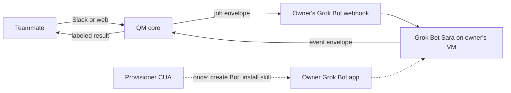
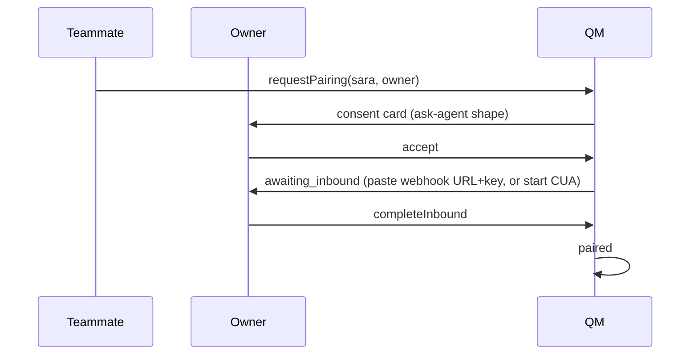

# Grok Bridge

System design for pairing a named QM agent to a consenting user's Grok Bot so
team rooms can use that person's computer without making Grok Bot multiplayer.

Status: implementing. Feature flag `grok_bridge`, default off.

## 1. Requirements

Functional:

- A teammate in a shared QM session can ask **Sara**.
- If Sara is paired to an owner's Grok Bot, QM sends the task there.
- Sara's Grok Bot runs on that owner's cloud computer (their plugins and
  sessions).
- The originating session shows progress and a final result, or a precise
  blocker (owner approval, 2FA, pairing broken).
- The owner can revoke pairing. In-flight jobs fail closed. Cached callback
  tokens stop working.

Non-functional:

- Fail closed on authz, unknown jobs, and unknown protocol versions.
- At-least-once delivery both directions, exactly-once projection into the
  session (`(job_id, seq)`).
- One in-flight job per pairing (backpressure). Queue depth cap 5, then 429.
- Job-scoped callback tokens. No long-lived org secret on the Grok Bot
  computer (every Bot on that user shares the disk).
- p95 dispatch (QM → Grok webhook accepted) < 2s excluding Grok runtime.
- Default job TTL 30 minutes, max 2 hours.

## 2. Constraints we do not fight

- Grok Bot has no public chat API. Official inbound is a **routine webhook**:
  POST starts a run; 200 is not completion; the body is input to a saved
  instruction.
- Grok Bot computers are per Cursor user. Share-a-Bot copies config only.
- Approvals and 2FA stay on that user unless we unlawfully click Allow.
- QM already has personal vs shared scopes, keychain grants, inbound
  webhooks, delivery idempotency, and `[[ask-agent]]` owner consent. The
  bridge is an adapter over those, not a second identity system.

## 3. Context



Actors:

| Actor         | Trust                      | Role                                            |
| ------------- | -------------------------- | ----------------------------------------------- |
| Teammate      | QM principal               | Asks Sara in a room they can already see        |
| Owner         | QM principal + Cursor user | Consents, holds Grok Bot computer, clicks Allow |
| QM core       | Deployment                 | Pairing, jobs, projection                       |
| Grok Bot Sara | Owner's computer           | Executes, POSTs events                          |
| Provisioner   | Optional                   | Installs skill / webhook; never the result bus  |

## 4. Module seam

Deep interface. Callers never see CUA, HTTP retries, or keychain paths.

```ts
interface GrokBridge {
  requestPairing(input: RequestPairing): Promise<PairingView>;
  decidePairing(id: string, ownerId: string, decision: "accept" | "decline"): Promise<PairingView>;
  completeInbound(id: string, ownerId: string, inbound: InboundCreds): Promise<PairingView>;
  revoke(id: string, actorId: string): Promise<void>;
  dispatch(input: DispatchJob): Promise<JobView>;
  ingest(raw: unknown, auth: CallbackAuth): Promise<IngestResult>;
  getJob(jobId: string, viewerId: string): Promise<JobView>;
}
```

Internal adapters (not on the interface): `PairingStore`, `JobStore`,
`SecretVault` (keychain), `OutboundPort` (Grok webhook POST),
`ProvisionerPort` (manual | CUA), `ProjectorPort` (session append + Slack
delivery). One adapter today for outbound HTTP. CUA is a second provisioner
adapter when it exists; until then `ManualProvisioner` is enough for a real
seam.

`src/grok-bridge/` follows those seams. `service.ts` is a facade over two
state machines; HTTP in `src/api/routes/grok-bridge.ts` talks only to
`GrokBridge`.

| Module                                      | Role                                                |
| ------------------------------------------- | --------------------------------------------------- |
| `types.ts`                                  | Deep interface, ports, records, views               |
| `crypto.ts`                                 | Protocol constants, tokens, hashes                  |
| `pairing.ts`                                | Pairing state machine                               |
| `jobs.ts`                                   | Job state machine, queue, ingest                    |
| `protocol.ts`                               | Job and event envelopes                             |
| `views.ts`                                  | Pairing and job API views                           |
| `authz.ts`                                  | Owner, guest, agent-name checks                     |
| `reply-skill.ts`                            | Skill text body                                     |
| `provisioner.ts`                            | Manual skill text (`ProvisionerPort`)               |
| `service.ts`                                | Compose pairing + jobs; revoke fails in-flight jobs |
| `pairing-store.ts`, `job-store.ts`          | Durable-map adapters                                |
| `durable-vault.ts`, `memory-vault.ts`       | `SecretVault` adapters                              |
| `http-outbound.ts`                          | `OutboundPort`                                      |
| `session-access.ts`, `session-projector.ts` | Session audience and projection                     |

Deletion test: if this module vanished, consent, job state, token hashing,
queueing, and event projection would reappear in webhook routes, Slack
ask-agent, and the web UI. That is the keep.

## 5. State machines

Pairing: `pending_consent` → `awaiting_inbound` → `paired` → `degraded` |
`revoked`. `degraded` means inbound POST failed or skill revision mismatch;
jobs refuse until `completeInbound` or a provisioner run.

Job: `queued` → `dispatched` → `accepted` → (`running`)* → `succeeded` |
`failed` | `needs_owner_approval` | `needs_human_on_computer` | `expired`.

Terminal: `succeeded`, `failed`, `expired`, plus pairing `revoked` which
fails the job. `needs_*` are parked, not terminal; a later event or owner
action resumes. Timeout from `dispatched` with no event → `expired`.

One in-flight non-terminal job per `pairingId`. Further dispatches enqueue.

## 6. Data

Pairing (durable map, like webhooks/triggers):

| Field              | Notes                                               |
| ------------------ | --------------------------------------------------- |
| `id`               | Opaque                                              |
| `agentName`        | `sara` — QM name, lowercased                        |
| `ownerPrincipalId` | Consenting QM person                                |
| `grokDisplayName`  | `QM · Sara` — find/create only                      |
| `grokBotId`        | Stable id after provision; never re-resolve by name |
| `inboundRef`       | Keychain credential id for webhook URL + bearer     |
| `skillRevision`    | `qm-grok-bridge/v1`                                 |
| `consent`          | `RecipientConsent` on the owner                     |
| `status`           | See §5                                              |
| `originScopeId`    | Scope where pairing was requested (audit)           |

Unique: `(ownerPrincipalId, agentName)` while not `revoked`.

Job:

| Field                               | Notes                                           |
| ----------------------------------- | ----------------------------------------------- |
| `id`                                | Also the idempotency key for outbound POST      |
| `pairingId`                         |                                                 |
| `originSessionId` / `originActorId` | Room + asker                                    |
| `instruction`                       | Untrusted text; screened like a webhook payload |
| `callbackTokenHash`                 | Store hash only                                 |
| `seqWatermark`                      | Last applied `seq`                              |
| `status`                            |                                                 |
| `expiresAt`                         |                                                 |

Events are not a second product record. Ingest applies them to the job and
projects. Raw body kept only as a hash + truncated security-screen input
(same 16k cap as webhooks).

## 7. Protocol `qm-grok-bridge/v1`

Dispatch body (QM → Grok Bot webhook):

```json
{
  "protocol": "qm-grok-bridge/v1",
  "job_id": "uuid",
  "qm_agent": "sara",
  "qm_session_id": "sess_…",
  "instruction": "…",
  "callback_url": "https://qm.example/v1/grok-bridge/jobs/{job_id}/events",
  "callback_token": "job-scoped bearer",
  "reply_required": true,
  "expires_at": "RFC3339",
  "approval_policy": "owner-must-approve-side-effects"
}
```

Event body (Grok Bot → QM):

```json
{
  "protocol": "qm-grok-bridge/v1",
  "job_id": "uuid",
  "seq": 1,
  "status": "accepted",
  "summary": "markdown, no secrets",
  "artifacts": []
}
```

`status` enum matches the job machine in §5 (except `queued` / `dispatched`,
which are QM-only). `seq` is monotonic per job, starting at 1. Duplicate
`(job_id, seq)` returns 200 and does not re-project. Gap in `seq` parks the
event until the hole fills or the job expires (fail closed: do not apply 3
before 2).

Auth: `Authorization: Bearer <callback_token>`. Compare hash. Token dies when
the job terminals or pairing revokes.

Unknown `protocol` → 400. Wrong `job_id` for the URL → 404. Token mismatch →
401 (no job existence leak beyond URL id).

The Grok Bot skill is the other half of the contract: do the work; POST an
event on every terminal or parked state, including failure; never skip the
POST; never use any token except this job's.

## 8. HTTP surface (QM)

| Method | Path                                   | Auth                                               |
| ------ | -------------------------------------- | -------------------------------------------------- |
| POST   | `/v1/grok-bridge/pairings`             | session / capability                               |
| POST   | `/v1/grok-bridge/pairings/:id/decide`  | owner                                              |
| POST   | `/v1/grok-bridge/pairings/:id/inbound` | owner                                              |
| POST   | `/v1/grok-bridge/pairings/:id/revoke`  | owner                                              |
| POST   | `/v1/grok-bridge/jobs`                 | session; membership on origin session              |
| GET    | `/v1/grok-bridge/jobs/:id`             | origin session member or owner                     |
| POST   | `/v1/grok-bridge/jobs/:id/events`      | public + bearer (like `/v1/webhooks/incoming/:id`) |

Flag off → 404 on all of these, same as other gated routes.

## 9. Sequences

Happy path (already paired):

```mermaid
sequenceDiagram
  participant T as Teammate
  participant Q as QM GrokBridge
  participant G as Grok Bot webhook
  participant B as Bot Sara
  T->>Q: dispatch(sara, instruction, session)
  Q->>Q: enqueue if busy; mint job token
  Q->>G: POST job envelope
  G-->>Q: 200 accepted run
  B->>Q: seq=1 accepted
  Q->>T: project "Sara picked this up"
  B->>Q: seq=2 succeeded + summary
  Q->>T: project result, labeled owner
```

First-time pairing:



CUA, when present, is `ProvisionerPort.ensure(pairing)`: open Grok Bot.app as
the owner, find or create `QM · Sara`, paste the skill, create a webhook
routine whose instruction is "read the JSON body, run it, POST events". It
does not type subsequent jobs.

## 10. Security

- **Audience.** Dispatch only if the asker can already read `originSessionId`
  and the pairing is `paired` + consent `accepted`. Results inherit that
  session's audience. Do not dispatch from a room the owner cannot see if the
  result would include owner-private data — default: owner must be a member of
  the origin session (same rule as sharing keychain results into a channel).
- **Tokens.** Callback token: ≥128 bits, job-scoped, hashed at rest, in the
  outbound envelope once. Inbound Grok webhook secret: keychain credential,
  owner personal scope, no grant to the room.
- **Shared Grok computer.** Skill text must say the token is per-job and must
  not be copied to `/workspace`. Other Bots on that account can still read
  memory if the owner is sloppy; expiry bounds blast radius.
- **Approvals.** QM never sends CUA commands that click Always allow. Park on
  `needs_owner_approval`. Live view is a later provisioner concern.
- **Screening.** `instruction` outbound and `summary` inbound go through the
  existing external-content security screen before transcript insert, same as
  webhook wakes.
- **Guest principals.** Cannot create pairings. Cannot dispatch.

## 11. Failure and operations

| Failure               | Behavior                                                             |
| --------------------- | -------------------------------------------------------------------- |
| Grok webhook non-200  | Retry with existing delivery backoff; then `degraded` + job `failed` |
| No event before TTL   | `expired`; tell the room to check owner Grok Bot                     |
| Seq gap               | Hold; do not project; expire if still gapped                         |
| Owner revokes mid-job | Fail job; 401 further events                                         |
| UI/skill missing      | Pairing `degraded`; refuse dispatch; offer provisioner               |
| Owner laptop asleep   | Irrelevant for webhook inbound; relevant only for CUA provision      |

Metrics: `grok_bridge_jobs{status}`, dispatch latency, ingest 401 rate, queue
depth per pairing, time-to-first-event, time-to-terminal. Logs carry
`job_id`, `pairing_id`, never raw tokens.

## 12. How this sits in QM

- **Identity / scopes:** owner is a `Principal`. Pairing is not a new scope
  kind. Work runs on Grok Bot, not on the QM sandbox for that session.
- **Ask-agent:** same consent card language. Different backend (Grok Bot vs
  personal QM sandbox). Do not overload `[[ask-agent]]` until the bridge is
  proven; expose an explicit `[[ask-grok: @person \| sara \| task]]` or a web
  control on the agent.
- **Webhooks:** outbound uses the owner's Grok URL (foreign). Inbound events
  are a dedicated route so we can enforce the protocol, not a generic wake
  that would start a QM turn by mistake.
- **Keychain:** inbound creds as a named credential `grok-bridge:{pairingId}`.
- **Peer coordination / swarms:** out of scope. This is person-owned
  execution, not QM-to-QM peers.

## 13. Build order

1. Flag, stores, protocol ingest + projection tests (no CUA, no Grok).
2. Manual `completeInbound` + dispatch to a real Grok webhook in one
   owner's account.
3. Consent UX (web + Slack card).
4. `ProvisionerPort` manual checklist in the UI (create Bot, skill text,
   routine).
5. CUA provisioner adapter: headed owner session, live view in the room,
   never auto-approve.

## 14. What success looks like

A channel asks Sara to pull a CRM list that only lives in Divyansh's Grok Bot
browser. Divyansh has accepted pairing. QM POSTs the job. Sara POSTs
`succeeded` with a table. The channel sees it as Sara, attributed to
Divyansh's Grok Bot. Nobody scraped a GUI. Nobody shared Divyansh's computer
with a second Cursor user.
