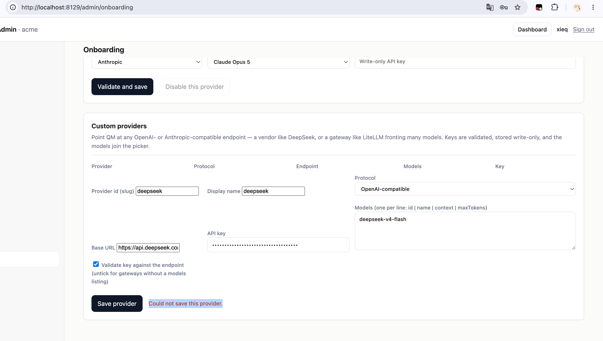
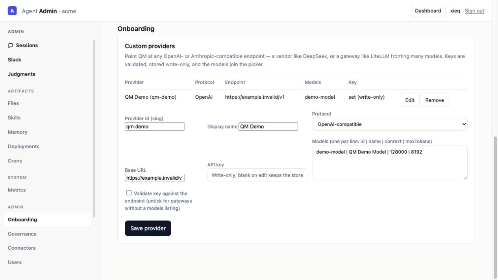

# Custom Provider Save Failure

## Symptom

The Admin onboarding page displayed `Could not save this provider.` when saving a custom provider. The server log showed that the request reached:

```text
PUT /v1/admin/custom-providers/deepseek 404
```



## Root cause

The custom-provider routes were registered, but `src/index.ts` did not pass the custom-provider store and refresh function from `buildApp` into `createServer`. The routes therefore had no server dependencies and returned `404` in the production-style application wiring.

## Fix

Pass both dependencies into `createServer`:

```ts
customProviders: built.customProviders,
refreshCustomProviders: built.refreshCustomProviders,
```

This keeps the existing route implementation intact and fixes the missing production wiring at the application composition boundary.

## Verification

- `npm run typecheck` passes.
- `node --experimental-test-module-mocks --test test/custom-provider-route.test.ts` passes: 3/3.
- The live Admin endpoint changed from `404` to `200`.
- A synthetic provider was saved successfully through the Admin UI and appeared in the provider list.
- The verification used a fake key and `https://example.invalid/v1`; no real provider credential was transmitted.


