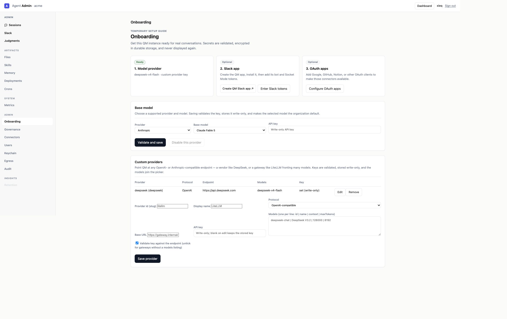
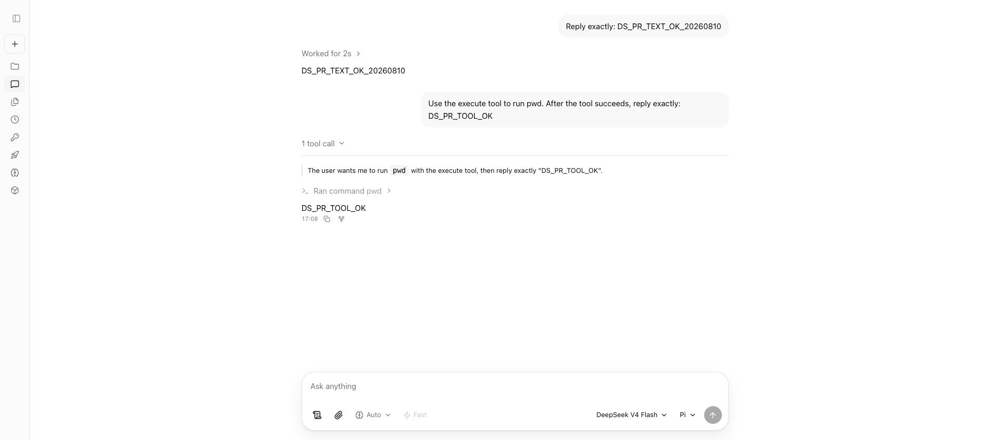

# Custom Provider Web Flow

## Reproduced failures

A production-style local instance exposed four separate breaks in the same flow:

1. `PUT /v1/admin/custom-providers/:id` returned `404` because the production entrypoint did not pass the custom-provider dependencies to the server.
2. A configured custom-provider key did not satisfy Portal or Admin readiness checks.
3. A custom model was rejected on Web turns unless the administrator explicitly saved a Web UI model allowlist.
4. The runtime config advertised the custom model, but the Web picker silently discarded it because the browser lacked its protocol metadata.

## Automated verification

- The production entrypoint is covered by a regression assertion for both required dependencies.
- Core route tests cover custom-provider readiness, status hygiene, runtime catalog metadata, and a Web turn without an explicit picker allowlist.
- Web UI tests cover generic OpenAI-compatible custom-model construction and selection.
- Admin tests cover custom-provider readiness, initial table loading, and readiness refresh after save/remove mutations.
- The full root suite passed once at 3,818 tests with 0 failures and 135 skipped. A later post-review run hit one unrelated OpenCode startup-output timing failure; that test passed immediately on an isolated rerun (10/10 OpenCode harness tests).
- Prettier, TypeScript, ESLint, and Oxlint checks pass.

## Live DeepSeek verification

The current branch was loaded through the repository's production-style dev supervisor and tested through Chrome against the saved `deepseek` provider. No credential is present in these artifacts.

- Portal `/` returned the Web application instead of redirecting to onboarding.
- Admin reported `Ready`, identified `deepseek-v4-flash · custom provider key`, and listed the provider with a write-only key status.
- The Web picker displayed `DeepSeek V4 Flash` under the Pi harness without requiring an explicit model allowlist.
- Text turn: `DS_PR_TEXT_OK_20260810`.
- Tool turn: the model called `execute` with `pwd`; Admin recorded exit code `0`, the next model request contained the tool result `/root/workspace`, and the model returned `DS_PR_TOOL_OK`.
- Session: `4de03b0b-6ec4-426d-aa72-8fd066cf9246`.

