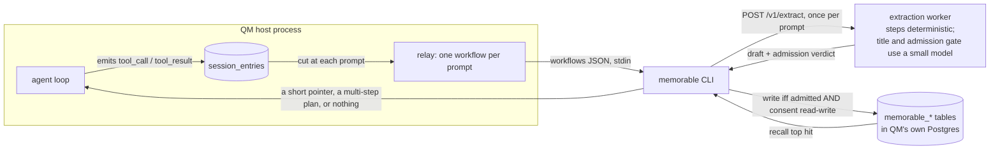

# Procedural memory (Memorable)

An optional, off-by-default integration that lets QM record _how_ a task was done and
replay it later. This page is the full contract. The [README section](../README.md#procedural-memory-memorable)
is the summary.

The integration is deliberately split. A small amount of code runs inside the QM process
and is readable in this repository. Everything else runs in a separate binary, the
`memorable` CLI, and in the service behind it. The distinction matters more than any
individual guarantee, so this page is organized around it: what QM enforces, and what QM
trusts.

## The unit is one prompt

A prompt and the tool calls that followed it become one _memorable_: which files changed,
which commands verified the work, in what order, with the real exit codes.

A session with four prompts produces up to four memorables, each keyed to its own prompt.
A prompt that produced no tool calls produces nothing. Tool calls that precede the first
prompt of a session are kept as their own memorable with an empty prompt.

This matters for recall quality. A session-wide record of four unrelated pieces of work
matches badly against a later prompt about one of them.

## What QM enforces

All of the following is in `src/config.ts`, `src/wiring.ts`, `src/core/orchestrator.ts`,
and the three files under `src/memorable/`.

### The switch

| Variable        | Default     | Effect                                                                                                                                                      |
| --------------- | ----------- | ----------------------------------------------------------------------------------------------------------------------------------------------------------- |
| `MEMORABLE`     | unset (off) | `1`/`true`/`yes`/`on` enables both capture and recall. Parsed by `boolEnvStrict`, so an unrecognized value is a startup error rather than a silent default. |
| `QM_MEMORABLE`  | unset       | The literal value `0` forces the integration off even when `MEMORABLE=1`.                                                                                   |
| `MEMORABLE_BIN` | `memorable` | The binary to spawn. Split on spaces, so `npx memorable` works. Spawned without a shell.                                                                    |

With the flag off, `buildApp` registers no `onTerminal` hook and passes no `memorable`
dependency to the orchestrator. The single check added to the turn path is
`useMemory && deps.memorable && input.text.trim()`, which short-circuits on an undefined
dependency before any work happens. The three modules under `src/memorable/` are imported
at boot either way; they are 155 lines that never run.

### Egress

QM adds no network call of its own. Verify it:

```
git diff origin/main...HEAD -- src/ | grep -E '^\+' | grep -E 'fetch\(|https?://|new URL|node:https?|net\.|WebSocket'
```

This returns nothing. The two new behaviors are a `spawn` of a local binary for recall
and a detached `spawn` of the same binary at run end for capture. Any network traffic
originates from that binary, on the machine QM is running on, after its own consent
checks.

### What the injected block may contain

`src/memorable/inject.ts` treats the subprocess's stdout as untrusted. A block is used
only if all of the following hold:

- The process exited `0`.
- The text opens with the literal data-not-instructions envelope prefix.
- After stripping, the text is at most 8,000 characters.

Stripping removes escape sequences by family, each matched as a whole sequence (CSI, OSC,
DCS/SOS/PM/APC, the enumerated two-character escapes, and a stray `ESC` last), then bare
control bytes other than tab and newline. Carriage return is stripped because it rewrites
a terminal line, which is a spoofing primitive in any surface that later prints a stored
command.

An over-length block is dropped whole, never truncated. The sentence that marks the block
as inert data sits at the end of it, so slicing to fit would remove exactly the part that
makes the block safe.

A recall attempt is bounded at 15 seconds, after which the child is killed and the turn
proceeds with no injected block. Any failure at any point yields no block rather than a
turn error.

### Prompt cache

The recalled block is appended to the system prompt _after_ `stableSystemBytes` is
measured, and that value is what gets passed as `systemCacheBoundary`. An injection
therefore does not invalidate the cached prefix.

### Capture

At the end of a run with no other active run on the thread, the session's entries are
read and split into workflows at each user prompt. Each tool call carries its name, its
input payload, and, joined by `callId`, whether it succeeded and its exit code when the
tool was `execute`. A quarantined result counts as a failure; success is never inferred.
The JSON goes to the binary's stdin.

Note what the input payload means in practice: it is the tool call's arguments minus
`tool` and `callId`. For a write, that includes the file contents. Anything a tool call
carried is what the subprocess receives.

## What QM trusts

None of the following is enforced by code in this repository. It is enforced by the
`memorable` binary and the service behind it, and it is listed here so an operator knows
what is being taken on trust.

- **Consent is per scope and fail-closed.** Writes happen only for scopes explicitly set
  to `read-write` via `memorable enable`. Unset means deny, and deny suppresses recall as
  well as writes.
- **Steps are deterministic.** The steps, commands, exit codes and postconditions in a
  stored memorable are built from the trace by a parser with no model call.
- **Two things do use a small model.** The human-readable title is written by one, and
  the second stage of the admission gate that decides whether a memorable is kept at all
  is another. Neither can change what a step says. The gate's first stage is a
  deterministic prefilter that refuses one-step traces, read-only traces, traces where
  every step is the same verb, and work with no checkable ending; only what survives it
  reaches the model.
- **Storage rides QM's own database.** The `memorable_procedures` and `memorable_mode`
  tables live in the same `DATABASE_URL` Postgres. There is no second store.

## Plans

A prompt that is several things at once can be answered with a plan instead of a single
memorable: several stored memorables in dependency order, each naming the files its
verified run wrote and the command that proved it. The order is derived rather than
guessed. A memorable that writes a file and one that reads it are a dependency, in that
direction, and both facts are already in the recorded steps. Steps sharing no dependency
are marked safe to run in parallel, and anything memory cannot cover is stated as such
rather than filled with the nearest vaguely similar memorable.

Opt in per call with `memorable inject --chain`, or `MEMORABLE_CHAIN=1`. A plan uses the
same envelope and the same size cap, so nothing in the harness changes to accept one.

## Known costs

- **Recall is on the turn's critical path.** When enabled, every turn that is not
  `skipMemory` awaits the subprocess before the model is called, bounded at 15 seconds.
- **The relay holds no state.** `onTerminal` fires once per run and the relay re-reads the
  session's entries each time, so a long session re-sends its earlier workflows on every
  later run. The binary skips workflows it has already stored, but a workflow the
  admission gate _refused_ has no stored row and is re-offered on each later run of that
  session.


