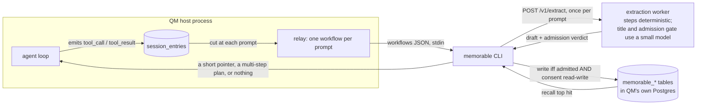

# Procedural memory (Memorable)

An optional, off-by-default integration that lets QM record _how_ a task was done and
replay it later. This page is the full contract. The [README section](../README.md#procedural-memory-memorable)
is the summary.

The integration is deliberately split. A small amount of code runs inside the QM process
and is readable in this repository. Everything else runs in a separate binary, the
`memorable` CLI, and in the service behind it. The distinction matters more than any
individual guarantee, so this page is organized around it: what QM enforces, and what QM
trusts.

## The unit is one prompt

A prompt and the tool calls that followed it become one _memorable_: which files changed,
which commands verified the work, in what order, with the real exit codes.

A session with four prompts produces up to four memorables, each keyed to its own prompt.
A prompt that produced no tool calls produces nothing. Tool calls that precede the first
prompt of a session are kept as their own memorable with an empty prompt.

This matters for recall quality. A session-wide record of four unrelated pieces of work
matches badly against a later prompt about one of them.

## What QM enforces

All of the following is in `src/config.ts`, `src/wiring.ts`, `src/core/orchestrator.ts`,
`src/api/routes/memorable.ts`, and the four files under `src/memorable/`.

### The switch

| Variable               | Default            | Effect                                                                                                                                                                                                      |
| ---------------------- | ------------------ | ----------------------------------------------------------------------------------------------------------------------------------------------------------------------------------------------------------- |
| `MEMORABLE`            | unset (off)        | `1`/`true`/`yes`/`on` enables both capture and recall. Parsed by `boolEnvStrict`, so an unrecognized value is a startup error rather than a silent default.                                                 |
| `QM_MEMORABLE`         | unset              | Any false value (`0`/`false`/`no`/`off`/`none`, case and padding insensitive) forces the integration off even when `MEMORABLE=1`. Same `boolEnvStrict` parser, so an unrecognized value is a startup error. |
| `MEMORABLE_BIN`        | `memorable`        | The binary to spawn. Split on spaces, so `npx memorable` works. Spawned without a shell.                                                                                                                    |
| `MEMORABLE_API_URL`    | the public service | Where device sign-in is performed. Point it at your own deployment of the extraction service to keep sign-in inside your perimeter.                                                                         |
| `CONNECTOR_SECRET_KEY` | unset              | Already required for the keychain. Without it, per-scope accounts are off and only the single `MEMORABLE_API_KEY` is used, because there would be nothing to encrypt a stored key with.                     |

### The binary

The published `memorable` CLI, unmodified. There is no QM-specific build of it and no
vendored copy of it in this repository.

```
npm i -g memorable-cli     # provides `memorable`
npm i pg                   # the qm backend's Postgres driver; it is not bundled
```

#### Accounts

Each scope can hold its own Memorable account, so a person's procedures land in their own
organization rather than in a shared one. There is no form to fill in and no key to
request: QM starts a device authorization (RFC 8628), hands the human a URL, and collects
whatever key comes back. QM never sees a password and never creates an account on
anyone's behalf.

```
POST   /v1/memorable/connect     start a device authorization; returns a URL and a code
GET    /v1/memorable/connect     poll it; `connected` once the human has approved
DELETE /v1/memorable/connect     forget the key and any authorization still in flight
POST   /v1/memorable/consent     set this scope's consent; nothing is captured until you do
GET    /v1/memorable/accounts    what is connected, admin-only, never with keys
```

**These act on the caller's own `personal:<actorId>` scope and nothing else.** Naming any
other scope is refused, with no admin override, for the same reason
`src/api/routes/connectors.ts` refuses it: whoever opens the URL is whoever the key
belongs to, so binding it to a channel would file the first person who clicked under
everyone else's name, and binding it to another person's scope would let an admin route
their transcripts to an organization they do not control. Post the URL where only that
person sees it.

A consequence to plan around: a session in a shared channel runs under `channel:<id>`,
which nobody can connect, so it uses the deployment's own key. Per-person accounts cover
personal-scope sessions. That is the conservative reading of who a channel's procedures
belong to, and it is deliberate rather than an oversight.

The flow is: `POST` the connect, show the human `verificationUriComplete`, and `GET`
until the status stops being `pending`. The window is ten minutes. A `503` means the
sign-in service could not be reached and nothing was stored. A transient failure while
polling reports `pending` rather than discarding a code the human may already have
approved.

#### Which key a spawn uses

| Order | Source                                   |
| ----- | ---------------------------------------- |
| 1     | the scope's own connected account        |
| 2     | `MEMORABLE_API_KEY` from the environment |

A key is never borrowed by a scope that did not connect it. A deployment where nobody has
connected keeps working exactly as before on the single environment key.

To get that environment key by hand instead, run `memorable login` once on a machine with
a browser (`--code` on a container or CI runner) and copy the `api_key` out of
`~/.memorable/config.json`.

#### What the CLI reads from QM's environment

| Variable            | Effect                                                    |
| ------------------- | --------------------------------------------------------- |
| `MEMORABLE_BACKEND` | `qm` — store in QM's Postgres rather than on this machine |
| `MEMORABLE_DB_URL`  | Where. Falls back to `DATABASE_URL`, which is QM's own    |
| `MEMORABLE_API_URL` | The extraction service                                    |
| `MEMORABLE_API_KEY` | The connected scope's key, or the deployment's; see above |

#### What lands in your database

Five tables, all on QM's DurableMap row shape (`id TEXT PRIMARY KEY, json JSONB NOT NULL`),
all in the database `DATABASE_URL` already points at. No new database is created.

Three are the CLI's, created on first write. QM ships no migration for these and the
schema is not QM's:

```sql
CREATE TABLE IF NOT EXISTS memorable_procedures (...);
CREATE TABLE IF NOT EXISTS memorable_mode       (...);
CREATE TABLE IF NOT EXISTS memorable_stats      (...);
```

Two are QM's own, created lazily by `artifactMap` exactly as `consent_links` and
`secret_drops` are, so there is no migration for these either:

```sql
CREATE TABLE IF NOT EXISTS memorable_accounts     (...);
CREATE TABLE IF NOT EXISTS memorable_device_codes (...);
```

`memorable_accounts` holds one row per connected scope. **The key is encrypted at rest**
with `deriveConnectorKey(CONNECTOR_SECRET_KEY, "memorable-accounts")`, the same AES-256-GCM
path `model_credentials` uses; nothing in the row is the key in the clear, and a row that
will not decrypt reads as no key rather than throwing. `memorable_device_codes` holds
in-flight authorizations, one row per scope, and carries no key. A row is replaced when
the same scope starts again and cleared when it is polled after expiry; a scope that
starts a sign-in and never polls again leaves its row until it does. There is no sweeper.

Removing the integration leaves all five behind; drop them if you want the data gone.

QM calls exactly two of its subcommands:

```
memorable inject --scope <scopeId>       # task on stdin, injected block on stdout
memorable record --scope <scopeId> -     # capture JSON on stdin
```

`-` is the CLI's own convention for "the input is on stdin"; without it `record` goes
looking for a session receipt on disk, which a server process does not leave.

Consent is per scope and falls back to the org that owns it, so
`memorable enable --scope org:<your-org>` once answers for every channel and person under
it, and a narrower scope answered for itself overrides that. Two absent answers are still
`unset`, and `unset` is deny.

With the flag off, `buildApp` registers no `onTerminal` hook and passes no `memorable`
dependency to the orchestrator. The single check added to the turn path is
`useMemory && deps.memorable && input.text.trim()`, which short-circuits on an undefined
dependency before any work happens. The three modules under `src/memorable/` are imported
at boot either way; they are 221 lines that never run.

Both variables are read once, by `loadConfig` at startup. Setting `QM_MEMORABLE=0` in a
running process does nothing until the process restarts. If you want a gate that answers
mid-session, say so: the idiom is already here in `src/resolution/config-store.ts`, next
to `getIndividualModelAuthDurable`, and we will move to it.

### Egress

QM makes exactly one class of outbound call of its own, and only to sign someone in.
`src/memorable/accounts.ts` posts to two endpoints and nothing else:

| Endpoint                     | When                     | Carries                                                                                             |
| ---------------------------- | ------------------------ | --------------------------------------------------------------------------------------------------- |
| `POST <api>/v1/device/code`  | someone starts a connect | a label like `qm channel a1b2c3d4`: the scope kind plus a truncated hash, never the scope id itself |
| `POST <api>/v1/device/token` | polling that connect     | the opaque device code                                                                              |

Neither carries a prompt, a tool call, a file, or a transcript. `<api>` is
`MEMORABLE_API_URL`. The `fetch` is injected through `createMemorableAccounts`, so no
test in this repository reaches the network.

Everything on the recall and capture paths is still spawn-only: a `spawn` of a local
binary for recall, and a detached `spawn` of the same binary at run end for capture. Any
network traffic carrying your data originates from that binary, on the machine QM is
running on, after its own consent checks. Verify the split:

```
grep -rnE 'fetch\(|https?://|node:https?|net\.|WebSocket' src/memorable/
```

Only `accounts.ts` answers.

### The child's environment

Spawned children get an allow-list, built once in `loadConfig` as `memorableProcessEnv`,
never the whole process environment:

```
PATH TMPDIR LANG LC_ALL SSL_CERT_FILE SSL_CERT_DIR NODE_EXTRA_CA_CERTS
HTTP_PROXY HTTPS_PROXY NO_PROXY ALL_PROXY HOME
MEMORABLE_BACKEND MEMORABLE_DB_URL MEMORABLE_API_URL MEMORABLE_API_KEY MEMORABLE_HOME
```

`MEMORABLE_BACKEND` defaults to `qm` and `MEMORABLE_DB_URL` to `DATABASE_URL`, so the CLI
writes into this deployment's Postgres without the operator having to know that; an
explicit value for either wins. `DATABASE_URL` itself is deliberately **not** forwarded:
the child gets the connection string under the one name that is meant for it.

The relay honours QM's own memory policy. With `MEMORABLE_CAPTURE=off` no session-end
relay is registered, and with recall off no injection is attempted, so procedural memory
cannot outlive the switch operators already use.

This mirrors what `codexProcessEnv` and `claudeProcessEnv` already do for the harnesses.
When the scope has a connected account, its key replaces `MEMORABLE_API_KEY` for that one
spawn; nothing else about the environment changes.

### What the injected block may contain

`src/memorable/inject.ts` treats the subprocess's stdout as untrusted. A block is used
only if all of the following hold:

- The process exited `0`.
- The text opens with the literal data-not-instructions envelope prefix.
- After stripping, the text is at most 8,000 characters.

Stripping removes escape sequences by family, each matched as a whole sequence (CSI, OSC,
DCS/SOS/PM/APC, the enumerated two-character escapes, and a stray `ESC` last), then bare
control bytes other than tab and newline. Carriage return is stripped because it rewrites
a terminal line, which is a spoofing primitive in any surface that later prints a stored
command.

An over-length block is dropped whole, never truncated. The sentence that marks the block
as inert data sits at the end of it, so slicing to fit would remove exactly the part that
makes the block safe.

A recall attempt is bounded at 15 seconds, after which the child is killed and the turn
proceeds with no injected block. Any failure at any point yields no block rather than a
turn error.

### Prompt cache

The recalled block is appended to the system prompt _after_ `stableSystemBytes` is
measured, and that value is what gets passed as `systemCacheBoundary`. An injection
therefore does not invalidate the cached prefix.

### Capture

At the end of a run with no other active run on the thread, the session's entries are
read and split into workflows at each user prompt. Each tool call carries its name, its
input payload, and, joined by `callId`, whether it succeeded and its exit code when the
tool was `execute`. A quarantined result counts as a failure; success is never inferred.
The JSON goes to the binary's stdin.

Note what the input payload means in practice: it is the tool call's arguments minus
`tool` and `callId` — whatever `recordCall` in `src/harness/pi-tools.ts` chose to record.
Anything a tool call carried into that payload is what the subprocess receives. The
subprocess then drops all but an allow-listed handful of those fields before anything
leaves the machine, but that is its guarantee to keep, not QM's.

## What QM trusts

None of the following is enforced by code in this repository. It is enforced by the
`memorable` binary and the service behind it, and it is listed here so an operator knows
what is being taken on trust.

- **Consent is per scope and fail-closed.** Writes happen only for scopes explicitly set
  to `read-write` via `memorable enable`. Unset means deny, and deny suppresses recall as
  well as writes.
- **Steps are deterministic.** The steps, commands, exit codes and postconditions in a
  stored memorable are built from the trace by a parser with no model call.
- **Two things do use a small model.** The human-readable title is written by one, and
  the second stage of the admission gate that decides whether a memorable is kept at all
  is another. Neither can change what a step says. The gate's first stage is a
  deterministic prefilter that refuses one-step traces, read-only traces, traces where
  every step is the same verb, and work with no checkable ending; only what survives it
  reaches the model.
- **Storage rides QM's own database.** The `memorable_procedures` and `memorable_mode`
  tables live in the same `DATABASE_URL` Postgres. There is no second store.
- **The trace is minimized before it leaves the machine.** The binary forwards a tool
  call's name, its outcome, and an allow-listed set of argument fields; a field not on
  that list is dropped rather than sent, home paths collapse to `~`, and
  credential-shaped strings are redacted. So the file contents QM's `write` tool carries
  in its payload do not travel.

## Plans

A prompt that is several things at once can be answered with a plan instead of a single
memorable: several stored memorables in dependency order, each naming the files its
verified run wrote and the command that proved it. The order is derived rather than
guessed. A memorable that writes a file and one that reads it are a dependency, in that
direction, and both facts are already in the recorded steps. Steps sharing no dependency
are marked safe to run in parallel, and anything memory cannot cover is stated as such
rather than filled with the nearest vaguely similar memorable.

Opt in per call with `memorable inject --chain`, or `MEMORABLE_CHAIN=1`. A plan uses the
same envelope and the same size cap, so nothing in the harness changes to accept one.

## Known costs

- **Recall is on the turn's critical path.** When enabled, every turn that is not
  `skipMemory` awaits the subprocess before the model is called, bounded at 15 seconds.
- **The relay holds no state.** `onTerminal` fires once per run and the relay re-reads the
  session's entries each time, so a long session re-sends its earlier workflows on every
  later run. The binary skips workflows it has already stored, but a workflow the
  admission gate _refused_ has no stored row and is re-offered on each later run of that
  session.


