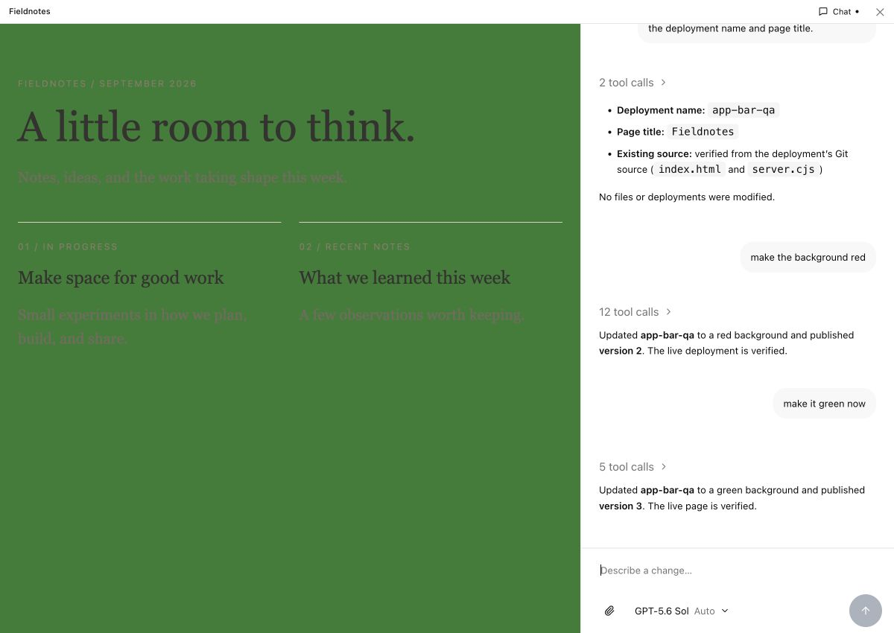
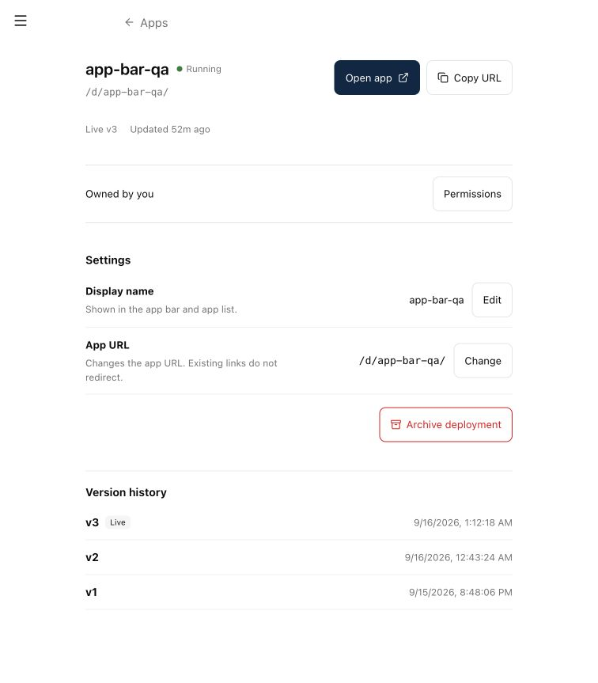
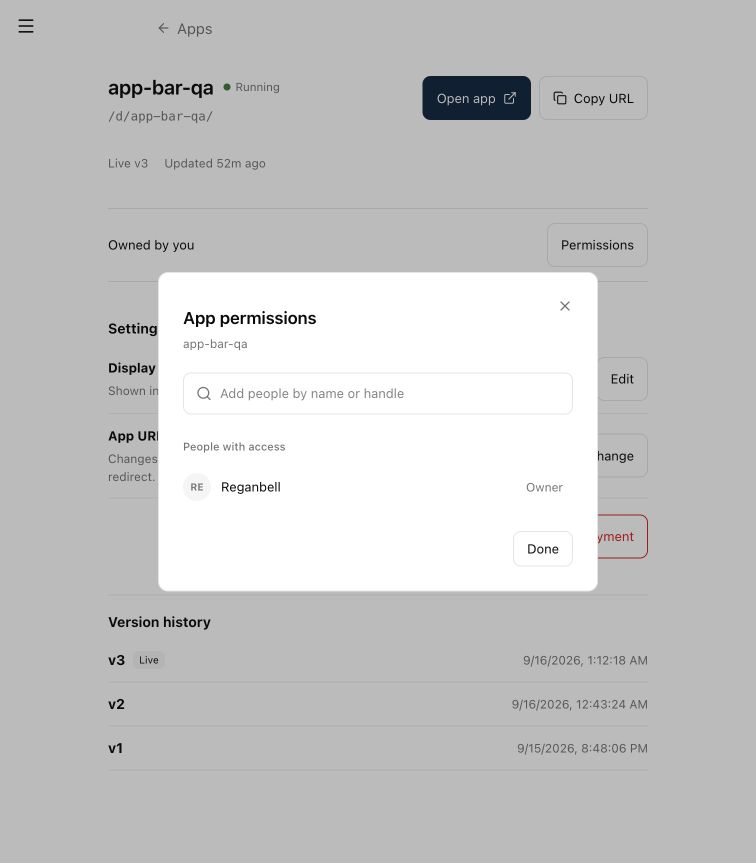

# App shell and management QA

Screenshots from a local web dev instance using the real Vite/Lit web UI, core, isolated Postgres, and a disposable Fieldnotes deployment. No UI or API responses are mocked. Loopback adapters supply the local development session and app host routing; the instance is not publicly accessible.

## App and chat

The agent identified the app from server-supplied conversation context, then published the requested background changes. The screenshot shows the green version requested during QA. The surrounding bar stays neutral.

## Manage

Long histories show the latest ten versions initially. “Show older versions” reveals ten more per click; tests exercise up to 150 versions.

## Permissions

Browser QA covered opening and closing the drawer, top-level escape, staging a person without granting access, the custom access menu, and the manage page. Earlier QA exercised adding view access, changing it to manage, and revoking the test grant. Tests cover dialog-bound menu placement and frame-denying upstream responses.

The picker adds people. Existing project/channel grants can be edited or removed; adding those scope types and an in-bar version selector are outside this change. The top-level escape applies to the current URL; navigation that drops its query parameter restores the shell.
