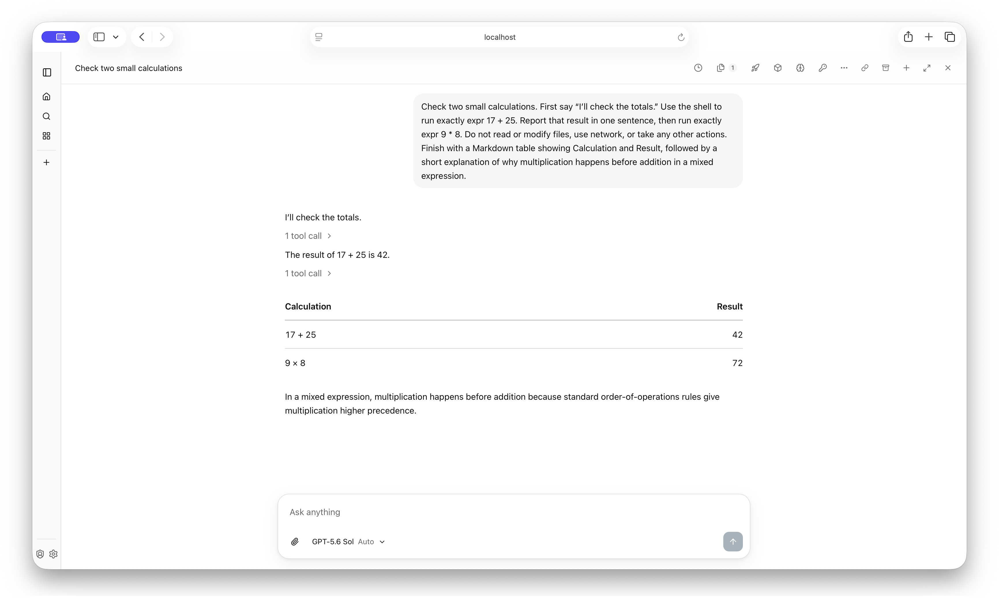
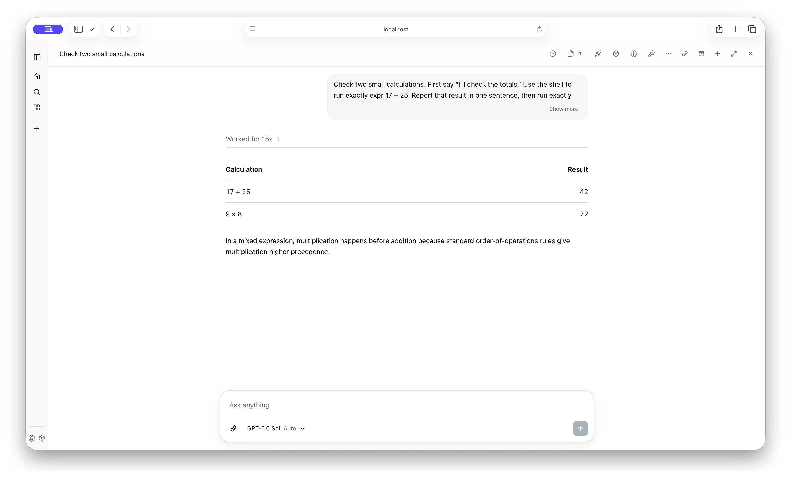
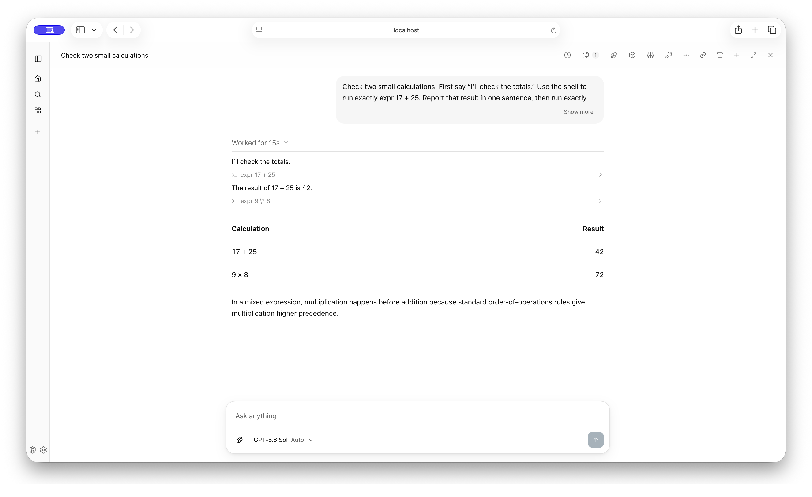

# Chat streaming and recovery QA

These screenshots use the real browser UI and isolated local core/Postgres with synthetic arithmetic prompts. No UI or API responses are mocked. The unchanged main frontend and updated frontend display the same saved conversation at the same window size. The local instance is not publicly reachable, so screenshots provide the review demo.

## Before

The latest prompt occupies several lines, and narration and tool summaries remain outside a single completed-work disclosure.

## After

The latest prompt starts as a two-line preview with Show more. Completed work collapses into one timed disclosure while the answer remains visible.

Expanding the disclosure shows narration and commands in their original order.

## Interaction checks

Live browser checks covered streamed prose, code and tables; manual scroll-away and selection; opening and closing split panes during streaming; Stop followed by reload and another turn; queued-message editing with attachments; approval decisions and duration; a 25-second connection outage; and expanded full tool output after reload. Backend-specific cancellation and transport races have deterministic regression coverage. Screenshots demonstrate the resting layout; they do not establish timing behavior by themselves.
