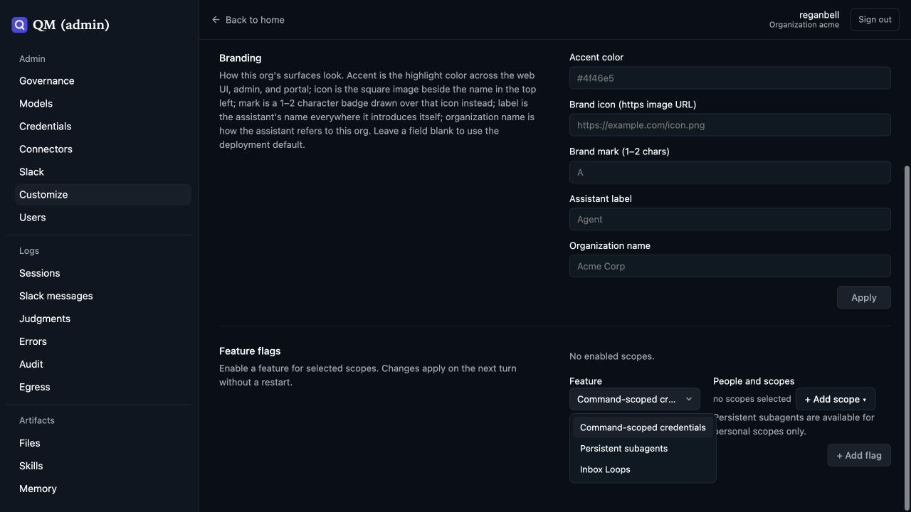
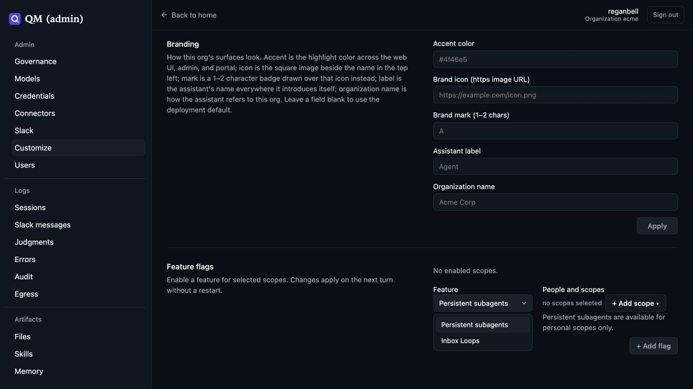

# Execution credential QA

The retired command-scoped credential flag is removed from Customize → Feature flags. The screenshots show the real admin page against a local development instance with synthetic data.

| Before                                       | After                                   |
| -------------------------------------------- | --------------------------------------- |
|  |  |

Live Slack QA used Firefox, a real model, local Docker/Postgres, and credentials containing disposable synthetic values with no authority:

- An execution without selection saw the variable absent.
- An execution selecting the saved handle verified the expected value and returned `prefix=<redacted:credential>:suffix`.
- The next execution without selection again saw the variable absent.
- Saving a second credential and selecting the returned handle within that same turn returned `new=<redacted:credential>:end`.
- A failing command preserved exit code 7 and surrounding stdout/stderr while masking the synthetic value.
- The retired tool was absent from the model tool catalog.

Postgres inspection confirmed the selected executions' tool-result entries and tape result content contained the mask and no raw synthetic values. User messages and tool arguments deliberately containing the synthetic fixture are outside output masking.

The change covers known injected env values in execution output. File credential restoration, the raw keychain use endpoint, and unrelated asynchronous/file output paths are separate work.
